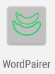
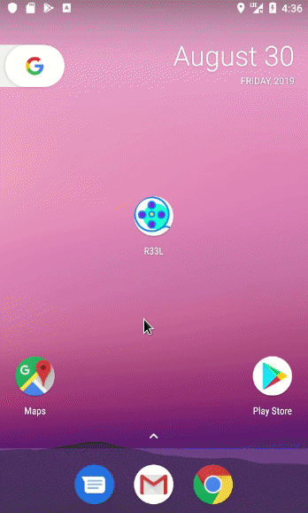

# Maiden Flight

My first Flutter application that generates word pairs. This repo is based off the following tutorials:

- [Part 1](https://codelabs.developers.google.com/codelabs/first-flutter-app-pt1/)
- [Part 2](https://codelabs.developers.google.com/codelabs/first-flutter-app-pt2/)

## Additions to the Base Tutorial

1. Changed app name to WordPairer
2. Replaced default app icon

 
 ➡ ️➡ ️➡ ️ 

3. Set color theme to teal
4. Changed heart color ❤️ to yellow 💛️
5. Display date and time on saved item in list view using the [intl library](https://pub.dev/packages/intl#-installing-tab-)
6. Added a leading icon to saved item in list view using [CupertinoIcons](https://api.flutter.dev/flutter/cupertino/CupertinoIcons-class.html)

## Getting Started

This project is a starting point for a Flutter application.

A few resources to get you started if this is your first Flutter project:

- [Lab: Write your first Flutter app](https://flutter.dev/docs/get-started/codelab)
- [Cookbook: Useful Flutter samples](https://flutter.dev/docs/cookbook)

For help getting started with Flutter, view our
[online documentation](https://flutter.dev/docs), which offers tutorials,
samples, guidance on mobile development, and a full API reference.
